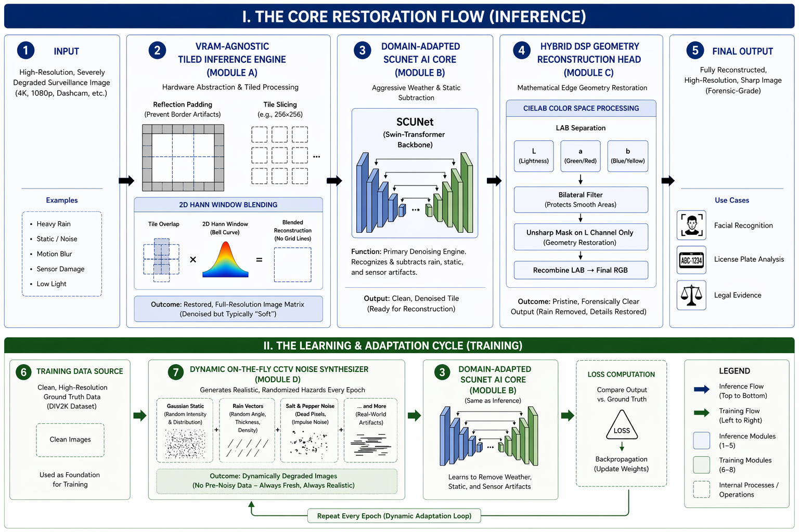

# Surveillance Image Denoising with a Hybrid SCUNet Pipeline

A Google Colab project for experimenting with CCTV image denoising through SCUNet fine-tuning, synthetic degradation, tiled inference, and classical image-processing stages.

[Open training notebook in Colab](https://colab.research.google.com/github/singh-himanshu3/CV_Project/blob/main/CV_AI_TRAINING.ipynb) · [Open inference notebook in Colab](https://colab.research.google.com/github/singh-himanshu3/CV_Project/blob/main/CV_Project.ipynb)

## Overview

The project adapts the open-source SCUNet architecture to synthetic CCTV-style degradations. The training notebook builds corrupted image patches and fine-tunes selected decoder layers. The inference notebook combines tiled model inference with median filtering, non-local means denoising, LAB-space contrast adjustment, and sharpening experiments.

## Pipeline



1. Generate training pairs with Gaussian noise, rain streaks, fog, low-light transformation, JPEG compression, and motion blur.
2. Fine-tune selected SCUNet decoder layers with a combined L1 and SSIM loss.
3. Run overlapping tiled inference to reduce peak GPU-memory usage.
4. Optionally apply classical pre-processing and post-processing for impulse noise, contrast, and edge enhancement.
5. Evaluate uploaded images with PSNR and SSIM when a clean reference image is available.

## Repository Contents

```text
CV_AI_TRAINING.ipynb   dataset synthesis and fine-tuning workflow
CV_Project.ipynb       image/video inference and evaluation experiments
architecture.png       pipeline diagram
```

## Run in Colab

1. Open `CV_AI_TRAINING.ipynb` and select a GPU runtime.
2. Run the setup cells, mount Google Drive, and provide the optional DIV2K archive at the path documented in the notebook.
3. Run the training cells to produce `scunet_cctv_weather_finetuned.pth` in Google Drive.
4. Open `CV_Project.ipynb`, load the generated weights, and run the image, video, or evaluation cells.

The notebooks install their Python dependencies at runtime and clone the upstream SCUNet implementation they import.

## Evaluation

The inference notebook contains code to calculate PSNR and SSIM for uploaded clean/noisy image pairs and to compare the base and fine-tuned models. Notebook outputs and a fixed evaluation dataset are not committed, so this README does not publish benchmark numbers. To make results reproducible, preserve the evaluation images, exact model weights, environment details, and exported metric outputs in a future revision.

## Dependencies

Key libraries include PyTorch, OpenCV, scikit-image, timm, einops, pytorch-msssim, matplotlib, and ipywidgets.

## Attribution

This work uses the [SCUNet implementation](https://github.com/cszn/SCUNet) and its pretrained model as the starting point. The repository contains notebooks and an architecture diagram; the upstream SCUNet source is fetched during notebook execution.

## Current Limitations

- The notebooks rely on Google Drive paths and an external upstream repository
- The fine-tuned weights are stored outside this repository
- Evaluation inputs and executed notebook outputs are not versioned
- No standalone package, command-line interface, or automated test suite is included
